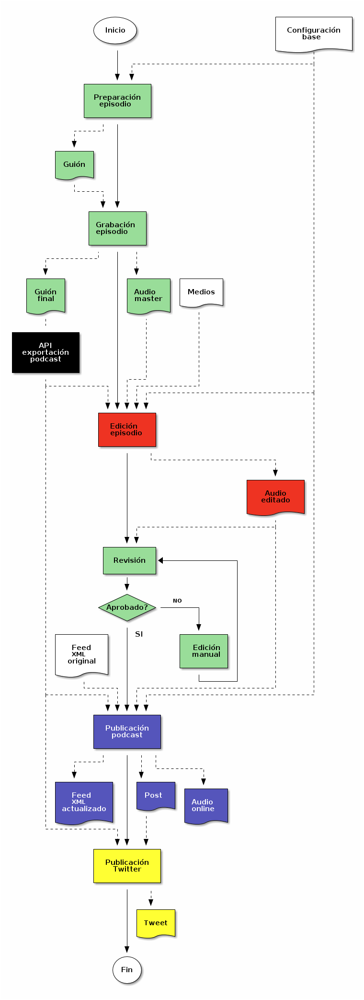

Plan de automatización de publicación para el Podcast de EDyO
=============================================================

Diagrama del plan
-----------------

El diagrama siguiente muestra el plan de publicación de episodios de nuestro podcast. Las líneas contínuas definen el flujo, mientras que las discontinuas definen las dependencias con documentos. Los pasos o documentos tienen colores según la herramienta o método utilizado para realizarlos o generarlos:

-   BLANCO: Prerequisitos ya existentes
-   VERDE: Manual
-   NEGRO: PSE - Podcast Script Exporter
-   ROJO: APPU - Automatic Podcast PUblisher
-   AZUL: Pan
-   AMARILLO: Tweet automático con IFTTT



Descripción del plan
--------------------

### Requisitos previos

Para la ejecución del plan, es necesario disponer de los siguientes elementos:

-   Configuración base: Contendrá valores de configuración básicos, como credenciales de servicios, valores genéricos, etc. Algunos de estos valores estarán en un fichero, otros, en variables de entorno.
-   Medios: Consistirán en los ficheros de medios, como las cuñas, logo, etc. Sus localizaciones y nombres de fichero, serán algunas de las configuraciones mencionadas.
-   Feed XML original: Será simplemente el contenido del Feed XML inicial.

### Preparación del episodio

La preparación del episodio consiste en concretar el tema, contactar con el entrevistado, si lo hay; poner la fecha que más se ajuste, inicializar y preparar el guión, de forma colaborativa, a veces, incluso con el invitado. Éste paso requiere la siguiente información de la configuración base:

-   Ubicación del Guión en la localización adecuada, que como se ha indicado, deberia poderse compartir para editar con invitados, entrevistados y otros.

El resultado debe ser un documento, denominado Guión, ubicado en la localización pertinente, que servirá para guiar la grabación del episodio.

### Grabación del episodio

La grabación del episodio se realiza, en la fecha planeada, siguiendo el guión. La herramienta que se utilice, es poco importante, siempre que:

-   Permita grabar con la calidad adecuada,
-   Sea fácil de utilizar por los invitados/entrevistados.

Éste paso tiene dos resultados importantes:

-   Guión final, en el que se han incluído los enlaces de lo que se ha comentado, y tiene unas secciones específicas con un formato concreto.
-   El fichero de audio maestro, resultado directo de la grabación.

### Edición del episodio

Con el fichero audio maestro, los ficheros de medios, la configuración base, y datos extraídos del Guión final, mediante la API de exportación, PSE; y usando APPU, se edita el podcast automáticamente, y genera el audio editado.

### Revisión

Una vez el audio editado ha sido generado, se realiza la revisión del audio. Éste paso es completamente manual, y consiste en que los miembros de EDyO escuchan el resultado de la edición, y validan si es aceptable para ser publicado. Si no lo es, hay que hacer edición manual, y volver a revisarlo. Una vez el audio editado se considera aceptable, se continúa.

### Publicación podcast

El proceso de publicación del podcast, se alimenta del audio editado, de la configuración base, de partes del guión final, a través de la API de exportación; y del **feed** XML original. El paso está automatizado mediante Pan, que se encarga de generar un nuevo fichero XML para el feed, un nuevo post en el blog, y poner online el fichero de audio, con el nuevo XML y el post.

### Publicación Twitter

Finalmente, al publicar el nuevo post, mediante ITTT, se realiza un tweet, con el enlace del post.

Podcast Script Exporter
-----------------------

-   Debe ser una API (librería con funciones/clases).
-   Puede abrir un documento y leerlo comprendiendo su estructura (secciones, subsecciones, contenido).
-   Dicha estructura puede ser devuelta con una estructura distinta, por ejemplo, JSON.
-   Provee funciones o métodos para buscar un sección concreta, por su título.
-   Ejemplo de uso, desde un programa:

    ``` bash
    pse = PSE(credentials)
    doc = pse.open(document_title)
    link_list = doc["Enlaces comentados"]   
    ```

Automatic Podcast PUblisher
---------------------------

-   Lee del guión ciertas secciones, usando PSE.
-   Recibe un fichero de audio, con la grabación maestra.
-   Dispone de un fichero de configuración en el que se definen algunos parámetros.
-   Genera un fichero de audio, con:
    -   El formato MP3.
    -   El volumen normalizado en el master.
    -   las cuñas, de entrada y salida, añadidas.
    -   Las etiquetas ID3 creadas (carátula, comentarios, etc).
-   Uso:

    ``` bash
    appu --title "Podcast 2041 - EDyO cumple 30 años" --master podcast-2041.mp4 --out /podcast/edyo-2041.mp3
    ```

Pan
---

-   Usando PSE, leerà ciertas secciones del guión final.
-   Recibe el fichero de audio con la versión editada.
-   Lee el fichero XML actual del feed.
-   Con los datos necesarios de la configuración, publica el fichero de audio editado, con una versión actualizada del feed, y el post en el blog.
-   Uso:

    ``` bash
    pan --title "Podcast 2041 - EDyO cumple 30 años" --audio /podcast/edyo-2041.mp3
    ```
